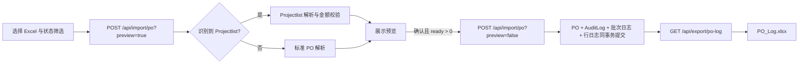

# 开发文档：Projectlist 批量导入与 PO Log 导出

> 状态：已实施\
> 文档日期：2026-08-05\
> 适用版本：Git 提交 `f6f20cd531c902cc236a323136418a6824f15aa1` 及以后\
> 功能入口：PO 页面 → “导入 Projectlist Excel” / “导出 PO Log”\
> 关联测试：[测试用例与执行报告](测试用例与执行报告_Projectlist批量导入与PO日志导出_2026-08-05.md)

## 1. 交付结论

本次交付已经打通以下闭环：

1. 从真实 Projectlist 工作表识别 PO 行；
2. 先预览、再确认正式导入；
3. 按工作类型解释数量、费率和金额；
4. 用稳定来源键处理重复行和来源内容变更；
5. 将正式导入的批次结果和逐行结果写入数据库；
6. 将全部 PO 导入日志导出为 `PO_Log.xlsx`。

该实现同时兼容原有标准 PO Excel。Projectlist 和标准 PO 共用 `POST /api/import/po`，由服务端自动识别格式。

## 2. 目标与范围

### 2.1 解决的问题

原有实现已经能识别并预览 Projectlist，但因数量/财务口径尚未确认，返回 `quantity_rule_confirmed=false`、`write_enabled=false`，不能正式写入 PO；同时也没有可长期追溯的批次和逐行结果。

本次实现的目标是：

- 接受包含 Projectlist 工作表的 `.xlsx`；
- 明确区分千字、小时和一口价，避免数量字段解释错误造成金额偏差；
- 对重复上传保持幂等，对同一来源身份的财务内容变化拒绝静默覆盖；
- 保存正式导入的批次和逐行结果；
- 允许编辑者下载可审计的 PO Log。

### 2.2 不在本次范围

- 不把上传文件本体保存到服务器；
- 不用整文件哈希阻止重传；
- 不自动创建 Projectlist 中不存在或无法精确匹配的译员；
- 不对真实业务文件自动执行正式写入；
- 不提供日志删除、归档、日期筛选或分页；
- 不解决 Render 免费实例临时磁盘的数据保留问题。

## 3. 使用与运行

### 3.1 本地准备

从仓库根目录执行：

```bash
cd backend
.venv/bin/python -m alembic -c alembic.ini upgrade head
./run.sh
```

浏览器打开 `http://127.0.0.1:8000/`。数据库必须先升级到 Alembic `20260805_0008`，否则 PO Log 表不存在。

### 3.2 操作流程

Projectlist 导入：

1. 使用 editor 角色登录；
2. 进入 PO 页面；
3. 在“结算 PO 状态”选择 `全部`、`已勾选`或`未勾选`；
4. 点击“导入 Projectlist Excel”并选择文件；
5. 查看预览中的可导入数、历史跳过数、错误数和样例；
6. 确认可导入结果后，允许系统发送正式导入请求；
7. 刷新 PO 列表核对新增记录；
8. 点击“导出 PO Log”下载 `PO_Log.xlsx`。

标准 PO 导入继续使用“导入标准 PO Excel”，也会在正式导入后写入同一套日志。

### 3.3 成功判定

- 预览请求只返回分析结果，不新增 PO、不新增日志；
- 正式导入返回导入、重复、历史跳过、来源冲突和错误计数；
- 新增 PO 可在 PO 列表查询；
- `PO_Log.xlsx` 包含“导入批次”和“行级明细”两个工作表；
- viewer 不能导入或导出 PO Log，接口返回 `403`。

### 3.4 可交给 Agent 的操作指令

只做无写入预览：

```text
启动本地服务，用 editor 登录，对指定 Projectlist Excel 调用 PO 导入预览。
只报告工作表、表头行、选中行、可导入、历史跳过、来源冲突和错误数量；不要执行正式导入。
```

正式导入前验收：

```text
先备份数据库并确认 Alembic 已到 20260805_0008；对文件执行 preview。
若 ready 大于 0，列出金额异常和译员匹配错误，等待人工确认；未获确认时不要发送 preview=false。
```

## 4. 请求链路



前端在打开确认框之前冻结本次 `projectlist_po_state`。即使用户在确认期间修改选择器，正式请求仍使用与预览相同的筛选值。

## 5. API 契约

### 5.1 导入接口

`POST /api/import/po`

| 项目 | 说明 |
|---|---|
| 权限 | editor；viewer 返回 `403` |
| Content-Type | `multipart/form-data` |
| 文件字段 | `file` |
| `preview` | 默认 `false`；`true` 时不写 PO 和日志 |
| `projectlist_po_state` | `all`、`checked`、`unchecked`；其他值返回 `400` |
| 格式识别 | 找到 Projectlist 工作表则按 Projectlist 解析，否则按标准 PO 解析 |

结构性错误，例如 Excel 无法读取、Projectlist 缺少必要表头，会在创建日志批次前直接返回 `400`。

### 5.2 日志导出接口

`GET /api/export/po-log`

| 项目 | 说明 |
|---|---|
| 权限 | editor；viewer 返回 `403` |
| 响应 | XLSX 二进制 |
| 文件名 | `PO_Log.xlsx` |
| 缓存 | `Cache-Control: no-store` |
| 类型保护 | `X-Content-Type-Options: nosniff` |
| 副作用 | 写入一条“导出 PO Log”的 AuditLog |

当前接口一次读取并导出全部日志，没有筛选和分页。

日志只覆盖本功能迁移后的正式导入。迁移前已经存在的 PO 没有可靠的源批次和源行，系统不会反向伪造行级日志。

## 6. Projectlist 识别与字段规则

### 6.1 工作表和表头

服务端按以下顺序识别：

1. 在工作簿中查找标题包含 `projectlist` 的第一个工作表，忽略大小写；
2. 在该工作表前 10 行查找表头；
3. 核心表头必须包含：`项目名称（稿件/LQA批次）`、`目标语言`、`指定译员`、`工作类型`；
4. 当前入口始终启用财务校验，因此还必须包含：`翻译费率`、`币种`、`译员WWC字数`、`稿费金额（CNY）`、`译员PO时间（X月）`、`结算PO`、`已打款`、`原语言`。

缺少必要表头属于文件结构错误，整个请求返回 `400`，不是逐行错误。

### 6.2 行是否属于 PO

- 项目、指定译员、工作类型三者都为空：视为非 PO 行，结果为 `ignored`；
- 只有 `结算PO` 和 `已打款` 两列状态都可识别后，任一为真才视为历史行并记 `skip_settled`；
- 历史行优先跳过，不要求译员存在，也不继续校验财务字段；
- 任一状态无法识别时先判为源数据错误：`all` 筛选下记 `invalid`；`checked/unchecked` 下是否选中只看 `结算PO`，该值未知时记 `ignored/not_selected`，该值恰好匹配筛选而仅 `已打款` 未知时仍记 `invalid`。

勾选状态接受布尔值、`1/0`、常见勾选符号，以及“是/否”“已勾选/未勾选”等文本；空白按未勾选处理。

### 6.3 项目、角色和译员

- 项目名称优先取 `归属项目`，缺失时取 `项目名称（稿件/LQA批次）`；
- 工作类型归一为翻译、审校、MTPE/AIPE、LQA、LQE、一口价或其他；
- 无法归类的工作类型不会猜测，正式导入记为 `invalid`；
- Projectlist 译员只允许当前姓名或历史别名的精确匹配；
- 精确匹配为 0 个或多个译员时均拒绝该行；
- 标准 PO 保留原有的模糊匹配逻辑。

## 7. 数量、费率和金额

### 7.1 计价映射

| 工作类型 | `译员WWC字数`的含义 | 系统计价模式 | Projectlist 费率转换 | 金额公式 |
|---|---|---|---|---|
| 翻译、审校、MTPE/AIPE | 字数 | `per_1000` | 源表每字费率 × 1000 | 数量 × 千字费率 ÷ 1000 |
| LQA、LQE | 小时数 | `per_hour` | 不转换 | 小时数 × 小时费率 |
| 一口价 | 不使用 | `fixed` | 不保存费率 | 直接取 CNY 稿费金额 |
| 其他/未知 | 不自动解释 | 不导入 | 不适用 | 人工处理 |

这是金额风险的核心：同一列在不同工作类型下不是同一个单位。

示例：

- 翻译行 `译员WWC字数=20000`、源费率 `0.18 CNY/字`，系统保存千字费率 `180`，金额为 `20000 × 180 ÷ 1000 = 3600 CNY`；
- LQA 行 `译员WWC字数=3`、费率 `120 CNY/小时`，这里的 `3` 是 3 小时，金额为 `360 CNY`；
- 一口价行 CNY 稿费为 `900`，数量和费率都留空，最终金额为 `900 CNY`。

如果把 LQA 的 `3` 当作 3 个字，或把翻译源费率 `0.18` 直接当作系统千字费率，都会产生数量级错误。因此未知工作类型不会自动套用公式。

### 7.2 有效性约束

- 币种只接受 CNY、USD、EUR；
- 非一口价的数量和费率必须大于 0；
- 一口价金额必须大于 0，且只接受 CNY；
- CNY 非一口价必须提供源表 CNY 稿费；
- 系统计算金额与源表 CNY 稿费的差额大于 `0.020001` 时，该行拒绝导入；
- USD/EUR 行不使用 CNY 稿费做同币种金额验算。

例如系统计算 `3600.00`，源表为 `3599.99`，差额 `0.01`，可接受；源表为 `3500.00`，差额 `100`，结果为 `invalid`。

### 7.3 语言和结算月

- 语言名称和代码先做别名归一；
- “欧洲语言”“亚洲语言”等分组值可结合项目文本提示推断；
- 目标语言缺失时，只能从同一文件、完全相同的源表译员姓名字符串和原语言的其他行得到唯一候选，否则拒绝；正式名和别名字符串不会在这一推断步骤合并；
- 每千字和每小时计价都必须得到有效原语言和目标语言；
- 结算月接受日期、`YYYY-M` 和 `X月`；日期或显式 `YYYY-M` 只校验月份格式；
- 只有 `X月` 需要补年：优先使用 DDL 年，缺少 DDL 年时尝试文件名中的年份；
- 只有 `X月` 且能解析 DDL 月时，月份小于 DDL 月才按跨年处理，并校验结算月相对 DDL 在 0–2 个月内；
- 显式日期或 `YYYY-M` 当前不做相对 DDL 的 0–2 个月窗口校验，这是已知边界。

## 8. 防重与来源冲突

### 8.1 来源身份

每个 Projectlist PO 先生成业务指纹：

```text
项目 + 结算月 + 原语言 + 目标语言 + 工作角色
```

同一译员、同一指纹可能有多行，因此按文件内出现顺序加入 `occurrence`，再生成：

```text
SHA-256("projectlist|译员ID|业务指纹|occurrence")
```

该值保存为 `po_settlements.source_key`。

`occurrence` 在状态筛选之前，按文件内已经通过逐行源字段/财务解析、非历史且能解析到译员的同行身份记录计算。因此同一文件切换 `checked/unchecked/all` 不会重新编号这些行的来源键；但前方同行身份的 invalid 行修正为 valid 后，会加入计数并可能改变后续行的 occurrence。

### 8.2 判定规则

| 场景 | 结果 | 是否新增 PO |
|---|---|---:|
| 来源键不存在 | `imported` | 是 |
| 来源键存在，业务和财务内容一致 | `skip_duplicate` | 否 |
| 来源键存在，但已存 PO 与本次可比字段不一致 | `source_conflict` | 否 |
| 并发插入命中唯一约束 | 重新读取并按上述两类比较 | 视比较结果 |

来源冲突不会覆盖旧 PO，错误信息会列出发生变化的字段。

项目、结算月、语言、角色和译员 ID 本身参与来源键计算。自然导入中修改这些身份字段会生成新来源键，被视为另一条业务身份；保持这些身份字段不变、只修改计价模式、币种、数量、费率或金额时，才是最常见的 `source_conflict`。系统内部仍会比较全部字段，以防数据库异常或哈希键被外部写入破坏。

### 8.3 已知顺序边界

`occurrence` 依赖同一业务指纹多行在文件中的顺序。如果这些行被重新排序，同时各行财务值不同，系统可能把它识别为来源冲突。这是当前稳定键方案的已知边界。

`po_settlements.word_count` 和 `rate` 当前只保留 2 位小数，而重复比较使用 `0.000001` 容差。源文件数量或转换后费率超过 2 位小数时，首次落库会被舍入；原文件重传可能因此被误判为 `source_conflict`。在修复为“按数据库精度量化后比较”之前，应避免导入超过 2 位小数的数量和系统费率。

整文件 `file_hash` 只用于审计和检索，不设唯一约束，也不阻止正式 API 重传。直接发送正式请求会新增一个批次并记录 `skip_duplicate`，但不会重复创建相同 PO；正常 UI 对完全重复文件通常在 `ready=0` 的 preview 阶段停止，因此不会新增批次。

## 9. 事务与日志持久化

### 9.1 原子提交

正式导入中的以下数据共用一个 SQLAlchemy Session，并在末尾统一提交：

- 新增 PO；
- PO 相关 AuditLog；
- PO 导入批次；
- 每个产生 outcome 的源行结果日志；标准模板的纯空白行不记录。

行级 PO 创建使用 savepoint 处理唯一键竞态。若日志持久化或最终提交失败，外层事务不会留下“PO 已写入但批次日志缺失”的半成品。

### 9.2 批次表

`po_import_batches` 保存：

- 操作者、来源格式、解析器版本；
- 文件 basename、SHA-256、工作表、表头行；
- Projectlist 状态筛选；
- 选中、忽略、导入、重复、历史跳过、来源冲突和错误计数；
- 创建时间。

API 响应里的 `ignored_rows` 只统计项目、译员和工作类型三项全空的非 PO 行；持久批次的 `ignored_rows` 由所有 `ignored` outcome 汇总，还包含被状态筛选排除的有效行和错误行。两者口径不同，不能直接用响应值核对导出批次值。

### 9.3 行级表

`po_import_row_logs` 保存：

- 批次、工作表和源行号；
- action、是否选中、PO ID、译员 ID/姓名；
- 项目、结算月、工作类型和语言；
- 计价模式、数量、费率、金额、源 CNY 稿费和币种；
- 来源键、错误码和错误消息。

唯一约束 `(batch_id, sheet, source_row)` 保证同一批次内每个源行只有一个最终结果。

允许的六种 action：

| action | 含义 |
|---|---|
| `imported` | 已创建 PO |
| `skip_duplicate` | 已存在且内容相同 |
| `skip_settled` | 已结算或已打款，按历史跳过 |
| `source_conflict` | 来源身份相同但内容变化 |
| `invalid` | 行数据不满足规则 |
| `ignored` | 非 PO 行或未被筛选选中 |

## 10. PO Log 工作簿

### 10.1 工作表

`导入批次`包含批次 ID、导入时间、操作者、格式、解析器版本、文件信息、筛选值和各类计数。

`行级明细`包含日志/批次 ID、文件与源行、原始 action、中文结果、PO/译员/项目、计价信息、来源键和错误信息。

即使数据库中还没有日志，也会返回只有表头的有效双工作表文件。

### 10.2 Excel 安全与可读性

- 冻结首行并开启自动筛选；
- 日期和数字使用原生 Excel 类型；
- 清理 Excel 不允许的控制字符；
- 以 `=`、`+`、`-`、`@` 开头的文本前置单引号，避免公式注入；
- 非有限数字输出为空；
- 根据 action 使用状态颜色。

## 11. 前端实现

- “导入标准 PO Excel”和“导入 Projectlist Excel”使用独立文件控件；
- Projectlist 支持 `all/checked/unchecked` 状态选择；
- 导入严格执行“预览 → 用户确认 → 正式写入”；
- 同一页面同时只能运行一个 PO 导入任务；
- `ready=0` 时停止，不弹确认框、不发送正式请求；
- “导出 PO Log”调用 `downloadAuth('/api/export/po-log', 'PO_Log.xlsx')`；
- 导入和导出按钮均使用 `.edit-only`，viewer 页面不显示。

## 12. 日志边界与故障处理

### 12.1 哪些错误会持久化

只要正式请求进入逐行处理并成功提交，混合文件中的 `invalid`、`source_conflict` 等结果就会写入行级日志。

### 12.2 哪些错误不会持久化

以下情况不会产生 PO 导入批次：

- 仅执行 preview；
- Excel 损坏或无法解析；
- Projectlist 缺必要表头；
- `projectlist_po_state` 非法；
- 前端预览得到 `ready=0` 后自动停止。

因此，“日志已持久化”准确含义是“正式导入事务的结果已写入数据库”，不是“每一次上传尝试都记录”。如果需要记录结构性失败或全错误预览，需要后续增加独立的上传尝试日志。

浏览器文件选择器只提示选择 `.xlsx`；服务端当前没有独立的扩展名和上传大小上限，并会把整个文件读入内存。生产入口应在反向代理设置请求体上限，超大文件场景仍需专项性能测试。

### 12.3 常见故障恢复

| 现象 | 检查 | 处理 |
|---|---|---|
| 缺表头并返回 400 | 查看响应错误中的缺失列 | 修正工作表表头后重新 preview |
| 所有译员都不存在 | 核对当前/历史姓名是否已录入 | 先维护译员及别名，不要开启模糊导入 |
| 金额偏差 | 核对工作类型、WWC 单位、费率单位和 CNY 稿费 | 修正源表；不要绕过金额校验 |
| 来源冲突 | 在 PO Log 查看来源键和差异字段 | 判断是源表修订还是行顺序变化，人工决定后续数据更正 |
| 下载为空表 | 查询是否发生过迁移后的正式导入 | preview 和迁移前 PO 不会补出行日志 |
| 部署后日志消失 | 检查 SQLite 是否位于持久盘 | 恢复备份或配置持久盘；临时盘数据无法从应用内恢复 |

## 13. 数据库迁移与部署

迁移文件：

```text
backend/migrations/versions/20260805_0008_add_po_import_logs.py
```

升级：

```bash
cd backend
.venv/bin/python -m alembic -c alembic.ini upgrade head
```

迁移新增 `po_import_batches` 和 `po_import_row_logs`。PO 的 `source_key`、`source_name`、`source_row` 已由早期迁移加入 `po_settlements`，本次直接复用。降级会删除两张日志表，执行前必须备份数据库。

容器默认数据库为 `/data/app.db`。要让 PO Log 跨重启、重新部署和实例替换保留，必须把整个 `/data` 挂载到持久盘并做备份恢复演练。当前 Render 免费实例使用临时 SQLite，实例重建后日志可能丢失，不能视为生产级持久化。

## 14. 代码位置

| 位置 | 职责 |
|---|---|
| `backend/app/routers/admin.py` | 格式识别、Projectlist 解析、导入、防重、导出接口 |
| `backend/app/models.py` | PO 来源字段、批次和行级日志模型 |
| `backend/app/po_import_logging.py` | outcome 校验、日志落库、XLSX 生成与安全清洗 |
| `backend/app/services.py` | PO 金额计算 |
| `backend/migrations/versions/20260805_0008_add_po_import_logs.py` | 数据库迁移 |
| `frontend/index.html` | 导入预览/确认流程、筛选与导出按钮 |
| `backend/tests/test_acceptance.py` | 导入和日志端到端验收 |
| `backend/tests/test_migrations.py` | 升降级、旧库和模型一致性 |
| `frontend/tests/po_import_ui.mjs` | 前端导入/导出专项测试 |

## 15. 与历史计划的差异

历史文档 `2026-08-05/未来计划/每日开发文档_09_PO防重与真实文件回归_2026-08-05.md` 是实施前方案，保留作决策记录，不代表最终设计。

最终实现的主要差异：

- 没有把整文件哈希设为唯一并整体拒绝重传；
- 防重粒度改为稳定行来源键；
- 来源身份不变时的可比财务内容变化单独记为 `source_conflict`；身份字段变化会生成新来源键；
- 日志使用独立批次表和行级表，而不是只在 PO 上挂批次外键；
- 真实 Projectlist 只做安全预览，没有对真实业务数据正式写入。

## 16. 验收基线与后续项

当前仓库验收基线为后端 `159/159`、前端 13 个脚本全部通过；迁移、隔离、质量、产能和数据完整性专项均通过。详细命令、数据和未覆盖项见关联测试文档。

后续优先级：

1. 为 Render/生产环境配置持久数据库、备份和恢复演练；
2. 记录结构性失败和 `ready=0` 的上传尝试；
3. 为 PO Log 增加日期、批次和 action 筛选以及分页/流式导出；
4. 按数据库精度量化来源值后再做重复/冲突比较；
5. 增加真实文件脱敏回归、事务故障注入和并发竞态测试；
6. 改进同业务身份多行重排时的稳定匹配。
